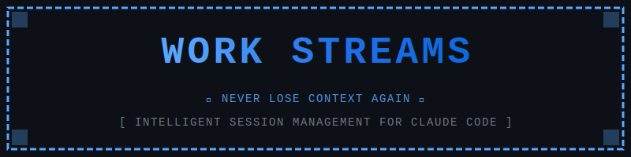
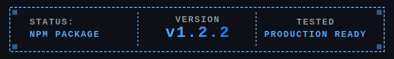

<p align="center">
  
</p>

<p align="center">
  
</p>

---

## Release Notes

### v1.1.0 - Stream Templates (Current Release)

This release adds a comprehensive template system providing structured guidance for common development workflows.

**New Features**:
• Stream templates for common workflows (feature, bug-fix, refactoring, documentation)
• `/stream-template` command with list/show/use actions
• Template integration with `/stream-start --template` flag
• Pre-defined goals, checkpoint guidance, and best practises per workflow
• Custom template support for user-defined workflows

### v1.0.0 - MVP Release

Initial release with core stream management functionality.

### Current Functionality
• 11 working commands for stream management
• Stream templates for common development workflows
• Template-driven workflow guidance with pre-defined goals
• Smart context injection and restoration
• Git integration with branch tracking and commits
• Context monitoring with optimised thresholds
• File based YAML metadata storage
• Tested with real context compaction scenarios

### Areas for Improvement

**Stability and Robustness**
• Error handling needs enhancement for edge cases
• No automatic recovery from failures
• Missing validation for malformed stream data
• No rollback capability for failed operations

**User Experience**
• No interactive prompts or confirmations
• Limited feedback during long operations
• No progress indicators
• Manual context threshold checking only

**Git Integration**
• No remote sync detection or conflict handling
• Missing branch protection checks
• No stash management
• Limited merge conflict support

**Stream Management**
• No stream search or filtering
• No archiving or cleanup features
• Cannot merge or split streams
• No stream dependencies or linking

**Collaboration**
• Single user only (no multi developer support)
• No stream sharing mechanisms
• Missing conflict resolution for shared streams
• No access control or permissions

**Advanced Features**
• No export to markdown or HTML reports
• Missing analytics or metrics
• No automated checkpoint suggestions
• Limited customization options
• No plugin system for extensions

### Roadmap

**v1.1.0: Stream Templates (Current Release)**
• Stream templates for common workflows ✓
• Template management commands ✓
• Pre-defined goals and guidance ✓
• Custom template support ✓

**v1.2.0: Stability and Enhanced UX (Next Release)**
• Comprehensive error handling
• Input validation and sanitization
• Automatic recovery mechanisms
• Interactive prompts for critical operations
• Progress indicators for long tasks
• Search and filtering capabilities

**v1.3.0: Advanced Git**
• Remote sync detection
• Merge conflict helpers
• Branch protection awareness
• Stash integration

**v2.0.0: Collaboration**
• Multi developer support
• Stream sharing and permissions
• Conflict resolution for shared streams
• Team coordination features

**v2.1.0: Analytics and Reporting**
• Export to markdown and HTML
• Development metrics and insights
• Automated checkpoint suggestions
• Customizable reports

**Contributions Welcome**: This is an open roadmap. Feature requests, bug reports, and pull requests are encouraged at [GitHub Issues](https://github.com/Tachyonoid-Technologies-Pty-Ltd/claude-work-streams/issues).

---

## The Problem

When working on complex features in Claude Code, you often hit context limits and need to start fresh sessions. This breaks your workflow as you manually track what you were doing, copy context, and re-explain your progress. Traditional session management tools are just note-taking systems that don't solve the real problem.

## The Solution

Claude Work Streams provides true session continuity by automatically preserving context, linking related sessions, and enabling seamless transitions when context limits are reached. Focus on building, not managing sessions.

## Features

- **Stream Templates**: Pre-configured workflows for common development patterns (feature, bug-fix, refactoring, documentation)
- **Template-Driven Workflows**: Pre-defined goals, checkpoint guidance, and best practises for each workflow type
- **Work Stream Tracking**: Group related work into continuous streams spanning multiple sessions
- **Smart Context Injection**: Automatic context restoration with intelligent summarization (under 2000 tokens)
- **Seamless Continuity**: Resume work streams with full context automatically injected
- **Flexible Progress Tracking**: Lightweight updates and comprehensive checkpoints
- **Context Monitoring**: Real-time context usage tracking with smart recommendations
- **Git Integration**: Full git support with branch tracking, commit management, and state monitoring
- **Stream Navigation**: Browse, resume, and manage multiple work streams
- **Neutral Commit Messages**: Professional git commits with no tool attribution
- **Custom Templates**: Create your own templates for recurring workflows

## Installation

1. Clone or download this repository to your local machine
2. Copy the `.claude` directory into your project root
3. The commands will be available immediately in Claude Code

```bash
# Clone the repository
git clone https://github.com/Tachyonoid-Technologies-Pty-Ltd/claude-work-streams.git

# Copy to your project
cp -r claude-work-streams/.claude /path/to/your/project/
```

Or manually:
1. Create `.claude/commands/` directory in your project
2. Copy all command files from this repository's `.claude/commands/` directory
3. Copy `plugin.json` to `.claude/` directory

## Quick Start

```bash
# Start a new work stream with goals
/stream-start "Add OAuth2 authentication" "- Implement OAuth2 flow" "- Add Google provider" "- Add GitHub provider"

# Make progress and save lightweight updates
/stream-update "Completed OAuth2 core implementation"

# Save comprehensive checkpoints
/stream-checkpoint "OAuth2 flow complete with Google provider"

# Check context usage
/stream-context-check

# Create git commits
/stream-git commit "feat: Add OAuth2 authentication with Google provider"

# View current status
/stream-status

# When ready to end
/stream-end

# Resume later with automatic context injection
/stream-resume add-oauth2-authentication
```

## Commands

### Stream Templates
- `/stream-template list` - Display all available templates (built-in and custom)
- `/stream-template show [name]` - View detailed template information and guidance
- `/stream-template use [template] [stream-name]` - Create stream from template
- `/stream-start [name] --template [template]` - Start stream with template (alternative method)

### Core Stream Management
- `/stream-start [description] [goals...]` - Begin a new work stream with goals
- `/stream-status` - View current stream with git integration and progress
- `/stream-checkpoint [description]` - Save comprehensive progress checkpoint with git state
- `/stream-update [note]` - Add quick timestamped progress note
- `/stream-resume [name]` - Continue a work stream with automatic context injection
- `/stream-list` - Browse all work streams (active, paused, completed)
- `/stream-end` - Complete and summarize work stream

### Context Management
- `/stream-context-check` - Monitor context usage with smart recommendations
- `/stream-context-inject` - Generate smart context summary from stream history

### Git Integration
- `/stream-git link [branch]` - Link stream to existing git branch
- `/stream-git create [branch]` - Create and link new git branch
- `/stream-git commit [message]` - Create neutral git commit with auto-staging
- `/stream-git status` - Show detailed git status for stream
- `/stream-git sync` - Sync stream metadata with current git state
- `/stream-git unlink` - Remove git branch association

## Usage Examples

### Basic Workflow
```bash
# Start a stream
/stream-start "Refactor authentication system"

# Work on your feature...
# Save progress periodically
/stream-checkpoint "Extracted auth logic into separate module"

# Check context usage
/stream-context-check
# Output: Context Status: 45% used, Status: Healthy

# Complete the stream
/stream-end
```

### With Git Integration
```bash
# Start stream and create git branch
/stream-start "Add payment processing"
/stream-git create feature/payment-processing

# Work and commit with neutral messages
/stream-git commit "feat: Add Stripe payment integration"

# Check git status
/stream-git status

# Complete stream
/stream-checkpoint "Payment processing complete"
/stream-end
```

### Using Stream Templates
```bash
# List available templates
/stream-template list

# View template details
/stream-template show feature-development

# Create stream from template (method 1)
/stream-template use feature-development user-authentication

# Or use with stream-start (method 2)
/stream-start oauth2-integration --template feature-development

# Template pre-populates:
# - 8 pre-defined goals (design, implement, test, document, review)
# - Context with decision points and next steps
# - Checkpoint guidance (5 key milestones)
# - Git branch suggestion (feature/oauth2-integration)
# - Tips and best practises

# Follow template guidance
/stream-checkpoint "Design complete - OAuth2 architecture defined"
/stream-checkpoint "Core implementation - OAuth2 flow working"
/stream-checkpoint "Tests complete - Unit and integration tests passing"
/stream-end
```

### Context Management
```bash
# Monitor context usage throughout development
/stream-context-check

# When context gets high (90%+), create checkpoint
/stream-checkpoint "API integration complete"

# End stream and resume later
/stream-end
/stream-resume add-payment-processing
# Automatic context injection restores full context
```

### Multi-Session Work
```bash
# Session 1: Start work
/stream-start "Database migration"
/stream-checkpoint "Migration scripts written"
/stream-end

# Session 2: Resume with full context
/stream-resume database-migration
# Context automatically restored
/stream-checkpoint "Migration tested"
/stream-end

# Session 3: Complete
/stream-resume database-migration
/stream-end
```

## Context Monitoring Thresholds

The plugin monitors your context usage and provides recommendations:

- **< 90%**: Healthy - Continue working normally
- **90-94%**: Monitor - Start planning checkpoint soon
- **95-97%**: Warning - Create checkpoint NOW and prepare transition
- **98%+**: Critical - Checkpoint and transition IMMEDIATELY

## Stream Metadata

All stream data is stored in `.claude/streams/[stream-name]/stream.yaml` with:
- Session history
- Checkpoints with git state
- Progress updates
- Goals and decisions
- File tracking
- Git integration data

## Why This Plugin?

Traditional session management approaches fail because they:
- Require manual context copying
- Don't preserve development context
- Lack git integration
- Don't monitor context usage
- Provide no automatic restoration

Claude Work Streams solves these problems with:
- Automatic context injection on resume
- Comprehensive git integration
- Real-time context monitoring
- Smart checkpointing system
- Professional, neutral commit messages

## License

MIT License - See LICENSE file

## Contributing

Contributions welcome! Please open an issue or pull request.

## Author

Built by [Tachyonoid Technologies Pty Ltd](https://github.com/Tachyonoid-Technologies-Pty-Ltd)

## Links

- **GitHub**: https://github.com/Tachyonoid-Technologies-Pty-Ltd/claude-work-streams
- **Issues**: https://github.com/Tachyonoid-Technologies-Pty-Ltd/claude-work-streams/issues
- **Organization**: https://github.com/Tachyonoid-Technologies-Pty-Ltd
