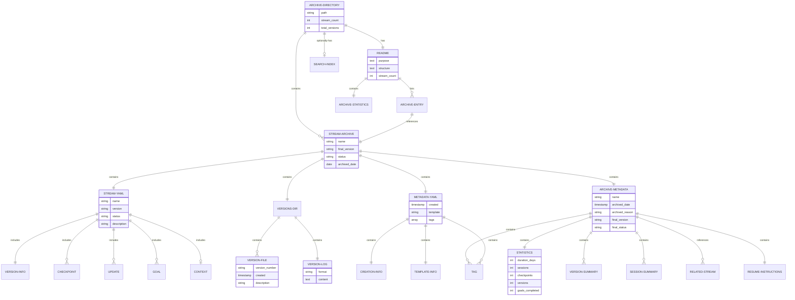

# Stream Archive Management Diagrams
## Visual Workflows and Process Documentation

**Document Purpose:** Provide comprehensive visual representations of archive management workflows, processes, and structures using Mermaid diagrams.

**Target Audience:** Developers and teams implementing or using archive management features.

**Companion Document:** [Stream Archive Management Guide](./stream-archive-management.md)

**Version:** 1.0.0
**Date:** 2025-11-03
**Status:** Complete

---

## Table of Contents

1. [Archive Process Flow](#1-archive-process-flow)
2. [Archive Directory Structure](#2-archive-directory-structure)
3. [Archive Decision Tree](#3-archive-decision-tree)
4. [Unarchive and Recovery Process](#4-unarchive-and-recovery-process)
5. [Archive Maintenance Schedule](#5-archive-maintenance-schedule)
6. [Search and Discovery Flow](#6-search-and-discovery-flow)
7. [Archive Index Management](#7-archive-index-management)
8. [Archive Metadata Relationships](#8-archive-metadata-relationships)
9. [Archive Integrity Check Process](#9-archive-integrity-check-process)
10. [Statistics Generation Flow](#10-statistics-generation-flow)
11. [Manual Archive Process](#11-manual-archive-process)
12. [Archive File Lifecycle](#12-archive-file-lifecycle)

---

## 1. Archive Process Flow

**Description:** Complete workflow from active stream to archived state, showing all steps and file operations.


---

## 2. Archive Directory Structure

**Description:** Hierarchical representation of archive directory structure with file descriptions.


---

## 3. Archive Decision Tree

**Description:** Decision logic for when and how to archive streams.


---

## 4. Unarchive and Recovery Process

**Description:** Workflow for restoring archived streams back to active directory.

```mermaid
flowchart TD
    Start([Recovery Request]) --> Method{Recovery Method?}

    Method -->|Command| UseCommand[/stream-unarchive stream-name]
    Method -->|Manual| ManualProcess[Manual Recovery Process]
    Method -->|Git Restore| GitRestore[Git History Restore]

    UseCommand --> VerifyArchive{Archive Exists?}
    VerifyArchive -->|Yes| CheckConflict{Active Stream<br/>with Same Name?}
    VerifyArchive -->|No| ErrorNotFound[Error: Archive not found]

    CheckConflict -->|Yes| ConflictResolution{Resolution Strategy?}
    CheckConflict -->|No| ProceedUnarchive[Proceed with Unarchive]

    ConflictResolution -->|Rename Active| RenameActive[Rename Active Stream]
    ConflictResolution -->|Rename Unarchived| RenameUnarchived[Unarchive with New Name]
    ConflictResolution -->|Cancel| CancelOperation[Cancel Unarchive]

    RenameActive --> ProceedUnarchive
    RenameUnarchived --> ProceedUnarchive

    ProceedUnarchive --> CopyFromArchive[Copy from Archive to Active]
    CopyFromArchive --> CopyStream[Copy stream.yaml]
    CopyStream --> CopyVersions[Copy versions/ directory]
    CopyVersions --> CopyMeta[Copy metadata.yaml]

    CopyMeta --> RemoveArchiveMeta[Remove archive-metadata.yaml]
    RemoveArchiveMeta --> UpdateStatus{Original Status?}

    UpdateStatus -->|completed| AskVersion[Prompt: Start New Version?]
    UpdateStatus -->|paused| CheckBlockers[Check Blockers in Metadata]

    AskVersion -->|Keep Current| KeepVersion[Status: completed<br/>Read-only reference]
    AskVersion -->|New Major| CreateMajor[Create New Major Version<br/>Status: active]
    AskVersion -->|Resume As-Is| ResumeCompleted[Status: active<br/>Same version]

    CheckBlockers --> BlockersInfo[Display Blocker Information]
    BlockersInfo --> ResumeDecision[Resume Instructions from Metadata]
    ResumeDecision --> SetActive[Status: active]

    KeepVersion --> UpdateCurrent1[Update .current-stream]
    CreateMajor --> UpdateCurrent1
    ResumeCompleted --> UpdateCurrent1
    SetActive --> UpdateCurrent1

    UpdateCurrent1 --> UpdateIndex[Update Archive Index]
    UpdateIndex --> RemoveEntry[Remove Entry from Archive README]
    RemoveEntry --> UpdateStatsArchive[Update Archive Statistics]

    UpdateStatsArchive --> GitCommitRestore[Git Commit]
    GitCommitRestore --> GitAddActive[git add streams/stream-name/]
    GitAddActive --> GitCommitMsg[git commit: Unarchive stream-name]

    GitCommitMsg --> Complete([Recovery Complete])

    ManualProcess --> ManualStep1[mkdir -p streams/stream-name]
    ManualStep1 --> ManualStep2[cp -r archive/stream-name/* streams/stream-name/]
    ManualStep2 --> ManualStep3[rm streams/stream-name/archive-metadata.yaml]
    ManualStep3 --> ManualStep4[Update stream.yaml status]
    ManualStep4 --> ManualStep5[echo stream-name > .current-stream]
    ManualStep5 --> ManualStep6[Update archive README]
    ManualStep6 --> ManualCommit[Git commit changes]
    ManualCommit --> Complete

    GitRestore --> FindCommit[git log --all -- archive/stream-name/]
    FindCommit --> Checkout[git checkout commit-hash -- archive/stream-name/]
    Checkout --> RestoreCommit[git commit: Restore from git]
    RestoreCommit --> FollowUnarchive[Follow Unarchive Process]
    FollowUnarchive --> Complete

    ErrorNotFound --> Failed([Recovery Failed])
    CancelOperation --> Cancelled([Operation Cancelled])

    style Start fill:#e1f5ff
    style Complete fill:#c8e6c9
    style Failed fill:#ffcdd2
    style Cancelled fill:#f5f5f5
    style CopyFromArchive fill:#fff9c4
    style UpdateIndex fill:#fff9c4
    style GitCommitRestore fill:#ffe0b2
```

---

## 5. Archive Maintenance Schedule

**Description:** Timeline showing regular maintenance tasks (weekly, monthly, quarterly).


---

## 6. Search and Discovery Flow

**Description:** Process flow for finding and filtering archived streams.

```mermaid
flowchart TD
    Start([Search Request]) --> SearchType{Search Criteria Type?}

    SearchType -->|Status| ByStatus[Search by Status]
    SearchType -->|Date Range| ByDate[Search by Date]
    SearchType -->|Tags| ByTags[Search by Tags]
    SearchType -->|Duration| ByDuration[Search by Duration]
    SearchType -->|Goals| ByGoals[Search by Goal Count]
    SearchType -->|Multiple| MultiCriteria[Multi-Criteria Search]

    ByStatus --> StatusQuery{Status Type?}
    StatusQuery -->|completed| GrepCompleted[grep 'final_status: completed'<br/>archive/*/archive-metadata.yaml]
    StatusQuery -->|paused| GrepPaused[grep 'final_status: paused'<br/>archive/*/archive-metadata.yaml]

    ByDate --> DateQuery{Date Range?}
    DateQuery -->|Specific Month| GrepMonth[grep 'archived_date: 2025-11'<br/>archive/*/archive-metadata.yaml]
    DateQuery -->|Last N Days| FindRecent[find archive/ -name<br/>archive-metadata.yaml -mtime -30]

    ByTags --> TagQuery{Single or Multiple?}
    TagQuery -->|Single Tag| GrepSingleTag[grep -l 'tag-name'<br/>archive/*/archive-metadata.yaml]
    TagQuery -->|Multiple AND| GrepMultipleTags[grep -l 'tag1' | xargs grep -l 'tag2']

    ByDuration --> DurationQuery{Duration Range?}
    DurationQuery -->|Short under 7| AwkShort[grep duration_days | awk '$2 < 7']
    DurationQuery -->|Medium 7-14| AwkMedium[grep duration_days | awk '$2 >= 7 && $2 <= 14']
    DurationQuery -->|Long over 14| AwkLong[grep duration_days | awk '$2 > 14']

    ByGoals --> GoalQuery{Goal Count Threshold?}
    GoalQuery -->|Few under 5| AwkFewGoals[grep goals_total | awk '$2 < 5']
    GoalQuery -->|Many over 10| AwkManyGoals[grep goals_total | awk '$2 >= 10']

    MultiCriteria --> Combine[Combine Multiple grep/awk Commands]
    Combine --> Pipeline[Build Search Pipeline]

    GrepCompleted --> Results[Collect Results]
    GrepPaused --> Results
    GrepMonth --> Results
    FindRecent --> Results
    GrepSingleTag --> Results
    GrepMultipleTags --> Results
    AwkShort --> Results
    AwkMedium --> Results
    AwkLong --> Results
    AwkFewGoals --> Results
    AwkManyGoals --> Results
    Pipeline --> Results

    Results --> Format{Output Format?}
    Format -->|List Files| ListFiles[List Matching Files]
    Format -->|Show Metadata| ExtractMetadata[yq Extract Metadata]
    Format -->|Count Only| CountResults[wc -l Count Results]
    Format -->|Full Details| FullDetails[cat Full Archive Entries]

    ListFiles --> Display[Display Results]
    ExtractMetadata --> Display
    CountResults --> Display
    FullDetails --> Display

    Display --> UseSearchIndex{Use Search Index?}
    UseSearchIndex -->|Yes| UpdateIndex[Update SEARCH-INDEX.md]
    UseSearchIndex -->|No| SkipIndex[Results Only]

    UpdateIndex --> Complete([Search Complete])
    SkipIndex --> Complete

    style Start fill:#e1f5ff
    style Complete fill:#c8e6c9
    style Results fill:#fff9c4
    style Display fill:#b2dfdb
```

---

## 7. Archive Index Management

**Description:** Workflow for creating and maintaining the archive README.md index.


---

## 8. Archive Metadata Relationships

**Description:** Entity relationship diagram showing how archive files relate to each other.



---

## 9. Archive Integrity Check Process

**Description:** Verification workflow to ensure archive completeness and consistency.


---

## 10. Statistics Generation Flow

**Description:** Process for calculating and generating archive statistics.

```mermaid
flowchart TD
    Start([Generate Statistics]) --> InitStats[Initialize Statistics]

    InitStats --> CountStreams[Count Archived Streams]
    CountStreams --> CountCmd1[ls -1d archive/*/ | wc -l]
    CountCmd1 --> StoreTotal[Store: Total Streams]

    StoreTotal --> CountByStatus[Count by Status]
    CountByStatus --> GrepCompleted[grep -c 'final_status: completed']
    GrepCompleted --> StoreCompleted[Store: Completed Count]
    StoreCompleted --> GrepPaused[grep -c 'final_status: paused']
    GrepPaused --> StorePaused[Store: Paused Count]

    StorePaused --> CountVersions[Count Total Versions]
    CountVersions --> FindVersions[find archive/ -name 'v*.yaml' | wc -l]
    FindVersions --> StoreVersions[Store: Total Versions]

    StoreVersions --> CalcDuration[Calculate Duration Statistics]
    CalcDuration --> ExtractDurations[grep 'duration_days:' all archives]
    ExtractDurations --> AwkSum[awk sum total days]
    AwkSum --> AwkAvg[awk calculate average]
    AwkAvg --> AwkMin[awk find minimum]
    AwkMin --> AwkMax[awk find maximum]
    AwkMax --> StoreDurationStats[Store Duration Stats]

    StoreDurationStats --> CalcSessions[Calculate Session Statistics]
    CalcSessions --> ExtractSessions[grep 'sessions:' all archives]
    ExtractSessions --> SumSessions[Sum total sessions]
    SumSessions --> AvgSessions[Calculate average sessions]
    AvgSessions --> StoreSessionStats[Store Session Stats]

    StoreSessionStats --> CalcHours[Calculate Development Hours]
    CalcHours --> ExtractHours[grep 'duration_hours:' all archives]
    ExtractHours --> SumHours[Sum total hours]
    SumHours --> AvgHours[Calculate average hours]
    AvgHours --> StoreHourStats[Store Hour Stats]

    StoreHourStats --> CalcGoals[Calculate Goal Statistics]
    CalcGoals --> ExtractGoalsCompleted[grep 'goals_completed:']
    ExtractGoalsCompleted --> ExtractGoalsTotal[grep 'goals_total:']
    ExtractGoalsTotal --> CalcCompletionRate[Calculate completion rate]
    CalcCompletionRate --> StoreGoalStats[Store Goal Stats]

    StoreGoalStats --> CalcVersionDist[Calculate Version Distribution]
    CalcVersionDist --> CountMajor[Count major versions: v*.0.0]
    CountMajor --> CountMinor[Count minor versions: v*.*.0]
    CountMinor --> CountPatch[Count patch versions: v*.*.*]
    CountPatch --> AvgMajor[Average major per stream]
    AvgMajor --> AvgMinor[Average minor per stream]
    AvgMinor --> AvgPatch[Average patch per stream]
    AvgPatch --> StoreVersionDist[Store Version Distribution]

    StoreVersionDist --> AnalyzeTags[Analyze Tag Distribution]
    AnalyzeTags --> ExtractTags[Extract all tags from metadata]
    ExtractTags --> CountTagOccur[Count tag occurrences]
    CountTagOccur --> SortTags[Sort by frequency]
    SortTags --> TopTags[Get top 10 tags]
    TopTags --> StoreTagDist[Store Tag Distribution]

    StoreTagDist --> CalcComplexity[Calculate Complexity Metrics]
    CalcComplexity --> GroupByGoals{Group by Goal Count}
    GroupByGoals --> Simple[Simple: under 5 goals]
    GroupByGoals --> Medium[Medium: 5-10 goals]
    GroupByGoals --> Complex[Complex: over 10 goals]

    Simple --> CountSimple[Count simple streams]
    Medium --> CountMedium[Count medium streams]
    Complex --> CountComplex[Count complex streams]

    CountSimple --> StoreComplexity[Store Complexity Distribution]
    CountMedium --> StoreComplexity
    CountComplex --> StoreComplexity

    StoreComplexity --> FormatReport[Format Statistics Report]
    FormatReport --> CreateSummary[Create Summary Section]
    CreateSummary --> CreateStatusTable[Create Status Table]
    CreateStatusTable --> CreateDurationTable[Create Duration Table]
    CreateDurationTable --> CreateVersionTable[Create Version Table]
    CreateVersionTable --> CreateTagTable[Create Tag Table]
    CreateTagTable --> CreateComplexityTable[Create Complexity Table]

    CreateComplexityTable --> OutputFormat{Output Format?}
    OutputFormat -->|Markdown| FormatMarkdown[Format as Markdown]
    OutputFormat -->|YAML| FormatYAML[Format as YAML]
    OutputFormat -->|JSON| FormatJSON[Format as JSON]
    OutputFormat -->|Table| FormatTable[Format as ASCII Table]

    FormatMarkdown --> WriteOutput[Write Statistics Output]
    FormatYAML --> WriteOutput
    FormatJSON --> WriteOutput
    FormatTable --> WriteOutput

    WriteOutput --> UpdateREADME[Update archive/README.md Statistics]
    UpdateREADME --> Timestamp[Add Generation Timestamp]
    Timestamp --> Complete([Statistics Complete])

    style Start fill:#e1f5ff
    style Complete fill:#c8e6c9
    style StoreTotal fill:#fff9c4
    style StoreCompleted fill:#fff9c4
    style StorePaused fill:#fff9c4
    style StoreVersions fill:#fff9c4
    style StoreDurationStats fill:#fff9c4
    style StoreSessionStats fill:#fff9c4
    style StoreHourStats fill:#fff9c4
    style StoreGoalStats fill:#fff9c4
    style StoreVersionDist fill:#fff9c4
    style StoreTagDist fill:#fff9c4
    style StoreComplexity fill:#fff9c4
```

---

## 11. Manual Archive Process

**Description:** Step-by-step manual archive process without using commands.


---

## 12. Archive File Lifecycle

**Description:** State machine showing the lifecycle of stream files from active to archived.


---

## Diagram Usage Guide

### When to Use Each Diagram

**1. Archive Process Flow**
- Planning archive implementation
- Understanding end-to-end archive workflow
- Training new developers
- Debugging archive issues

**2. Archive Directory Structure**
- Setting up archive directory
- Understanding file organization
- Planning storage strategy
- Documentation reference

**3. Archive Decision Tree**
- Deciding when to archive
- Understanding automatic vs manual archiving
- Handling edge cases
- Policy documentation

**4. Unarchive and Recovery Process**
- Restoring archived streams
- Recovery planning
- Handling conflicts
- Disaster recovery procedures

**5. Archive Maintenance Schedule**
- Planning maintenance tasks
- Resource allocation
- Team responsibilities
- Quality assurance

**6. Search and Discovery Flow**
- Implementing search features
- Query optimization
- User interface design
- Performance tuning

**7. Archive Index Management**
- Maintaining archive index
- Index organization
- Update procedures
- Consistency checks

**8. Archive Metadata Relationships**
- Understanding data model
- Database design
- Query planning
- Data validation

**9. Archive Integrity Check Process**
- Quality assurance
- Audit procedures
- Error detection
- Validation workflows

**10. Statistics Generation Flow**
- Reporting implementation
- Metrics calculation
- Dashboard design
- Performance monitoring

**11. Manual Archive Process**
- Emergency procedures
- Command failure fallback
- Training documentation
- Troubleshooting guide

**12. Archive File Lifecycle**
- Understanding state transitions
- Process documentation
- System design
- Lifecycle management

---

## Implementation Notes

### Mermaid Diagram Types Used

**Flowchart (flowchart TD):**
- Archive Process Flow
- Archive Decision Tree
- Unarchive and Recovery Process
- Search and Discovery Flow
- Archive Index Management
- Archive Integrity Check Process
- Statistics Generation Flow
- Manual Archive Process

**Graph (graph TD):**
- Archive Directory Structure

**Gantt Chart (gantt):**
- Archive Maintenance Schedule

**Entity Relationship Diagram (erDiagram):**
- Archive Metadata Relationships

**State Diagram (stateDiagram-v2):**
- Archive File Lifecycle

### Color Coding Legend

**Node Colors:**
- Light Blue (e1f5ff): Start/Entry points
- Green (c8e6c9): Completion/Success states
- Red (ffcdd2): Error/Failure states
- Yellow (fff9c4): Important operations/decisions
- Orange (ffe0b2): Git operations
- Light Green (b2dfdb): Display/Output operations
- Gray (f5f5f5): No action/Skip operations
- Teal (b2dfdb): Automatic operations
- Light Orange (ffccbc): Manual operations

### Rendering Diagrams

These Mermaid diagrams render natively in:
- GitHub (markdown files)
- GitLab (markdown files)
- VS Code (with Mermaid extension)
- Documentation sites (MkDocs, Docusaurus, etc.)
- Browser (with Mermaid.js library)

**Online Rendering:**
- https://mermaid.live - Live editor and preview
- https://mermaid-js.github.io - Official documentation

---

## Related Documentation

**Comprehensive Guides:**
- [Stream Archive Management Guide](./stream-archive-management.md) - Practical operations
- [Stream Versioning and Archiving System](./stream-versioning-and-archiving.md) - Complete specification
- [Work Streams Documentation Hub](./README.md) - All documentation index

**Other Diagram Sets:**
- [Stream Archaeology Agent Diagrams](./v1.3.0-stream-archaeology-diagrams.md) - 12 diagrams for intelligent analysis
- [Autonomous Context Engineering Diagrams](./v1.3.0-autonomous-context-engineering-diagrams.md) - 15 diagrams for context management

---

**Document Version:** 1.0.0
**Last Updated:** 2025-11-03
**Author:** Work Streams Team
**Status:** Complete

**Total Diagrams:** 12 comprehensive Mermaid diagrams covering all archive management workflows and processes.