# Autonomous Context Engineering - Visual Diagrams
## Work Streams v1.3.0 - Technical Flowcharts

**Date:** 2025-10-31
**Companion Document:** `v1.3.0-autonomous-context-engineering-research.md`

---

## Table of Contents

1. [Autonomous Checkpoint Process](#1-autonomous-checkpoint-process)
2. [Autonomous Update Process](#2-autonomous-update-process)
3. [Context Injection Process](#3-context-injection-process)
4. [Multi-Agent Architecture](#4-multi-agent-architecture)
5. [Goal Tracking Intelligence](#5-goal-tracking-intelligence)
6. [Current vs. Proposed Comparison](#6-current-vs-proposed-comparison)

---

## 1. Autonomous Checkpoint Process

### Overview Flowchart

```mermaid
flowchart TD
    Start([User runs /stream-checkpoint]) --> Input{Description provided?}
    Input -->|Yes| UseDesc[Use provided description]
    Input -->|No| GenDesc[Generate from conversation]

    UseDesc --> Phase1[Phase 1: Context Analysis]
    GenDesc --> Phase1

    Phase1 --> ScanConv[Scan conversation<br/>since last checkpoint]
    ScanConv --> ClassifyInfo{Classify Information}

    ClassifyInfo -->|High Signal| PreserveInfo[Preserve:<br/>- Decisions<br/>- Implementations<br/>- Resolutions<br/>- Blockers]
    ClassifyInfo -->|Low Signal| DiscardInfo[Discard:<br/>- Redundant outputs<br/>- Failed attempts<br/>- Debug iterations]

    PreserveInfo --> Phase2[Phase 2: Goal Intelligence]
    DiscardInfo --> Phase2

    Phase2 --> ParseConv[Parse for completion indicators:<br/>completed, finished, working, tested]
    ParseConv --> MatchGoals[Match against current goals:<br/>- Keyword matching<br/>- File analysis<br/>- Context analysis]
    MatchGoals --> ConfScore{Calculate confidence score}

    ConfScore -->|90-100%| AutoMark[Auto-mark complete<br/>Log reasoning]
    ConfScore -->|70-89%| FlagReview[Mark complete<br/>Flag for review]
    ConfScore -->|50-69%| AddProgress[Add progress note<br/>Don't mark complete]
    ConfScore -->|<50%| NoAction[No action<br/>Insufficient evidence]

    AutoMark --> Phase3[Phase 3: Context Compression]
    FlagReview --> Phase3
    AddProgress --> Phase3
    NoAction --> Phase3

    Phase3 --> MaxRecall[Maximize Recall:<br/>Capture ALL relevant info]
    MaxRecall --> OptPrecision[Optimize Precision:<br/>Compress to 1,000-2,000 tokens]
    OptPrecision --> Structure[Structure in YAML:<br/>- Decisions<br/>- Completed<br/>- In Progress<br/>- Blockers<br/>- Files<br/>- Next Actions]

    Structure --> Phase4[Phase 4: Memory Persistence]
    Phase4 --> WriteFile[Write to stream.yaml<br/>File-based storage]
    WriteFile --> Index[Index by timestamp<br/>Cross-session persistence]

    Index --> Phase5[Phase 5: User Feedback]
    Phase5 --> ShowStats[Display compression stats:<br/>- Source tokens<br/>- Compressed tokens<br/>- Reduction %]
    ShowStats --> ShowGoals[Show goal updates:<br/>- Auto-completed<br/>- Progress updated]
    ShowGoals --> ShowContext[Show context captured:<br/>- Decisions count<br/>- Files modified<br/>- Next actions]

    ShowContext --> End([Checkpoint Complete])

    style Phase1 fill:#e1f5ff
    style Phase2 fill:#e1f5ff
    style Phase3 fill:#e1f5ff
    style Phase4 fill:#e1f5ff
    style Phase5 fill:#e1f5ff
    style AutoMark fill:#c8e6c9
    style FlagReview fill:#fff9c4
    style AddProgress fill:#ffe082
    style NoAction fill:#ffccbc
```

### Detailed Context Analysis Phase

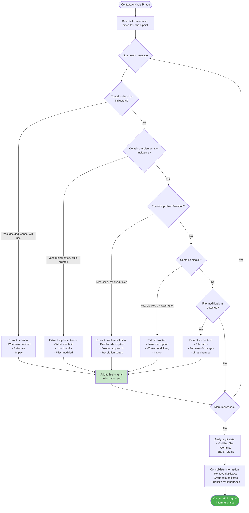

### Detailed Goal Intelligence Phase

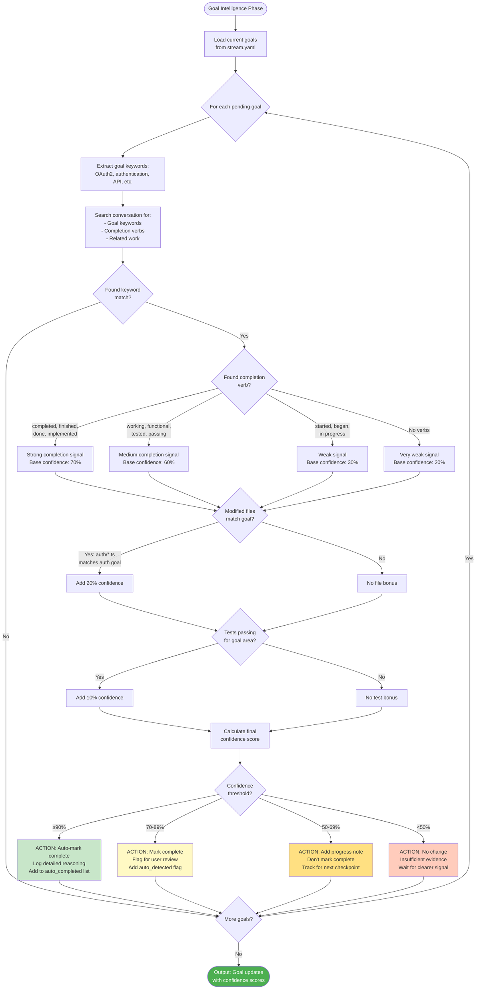

---

## 2. Autonomous Update Process

```mermaid
flowchart TD
    Start([User runs /stream-update note]) --> Phase1[Phase 1: Update Classification]

    Phase1 --> AnalyzeNote[Analyze update note text]
    AnalyzeNote --> CheckType{Classify type}

    CheckType -->|Contains: X% done,<br/>almost finished| TypeProgress[Type: Progress Update<br/>Extract percentage]
    CheckType -->|Contains: decided to,<br/>chose, will use| TypeDecision[Type: Decision Note<br/>Flag for checkpoint]
    CheckType -->|Contains: blocked by,<br/>waiting for, issue| TypeBlocker[Type: Blocker<br/>Flag for checkpoint]
    CheckType -->|Contains: found,<br/>learned, discovered| TypeDiscovery[Type: Discovery<br/>Analyze further]
    CheckType -->|Contains: file paths,<br/>function names| TypeFile[Type: File Context<br/>Associate with files]

    TypeProgress --> Phase2[Phase 2: Goal Association]
    TypeDecision --> Phase2
    TypeBlocker --> Phase2
    TypeDiscovery --> Phase2
    TypeFile --> Phase2

    Phase2 --> ExtractKeywords[Extract keywords<br/>from update note]
    ExtractKeywords --> MatchGoalKW[Match against<br/>goal keywords]
    MatchGoalKW --> FoundMatch{Match found?}

    FoundMatch -->|Yes| AssociateGoal[Associate with goal:<br/>- Add to goal updates<br/>- Update progress % if indicated<br/>- Add timestamp]
    FoundMatch -->|No| NoAssociation[No goal association<br/>Store as general update]

    AssociateGoal --> Phase3[Phase 3: Lightweight Persistence]
    NoAssociation --> Phase3

    Phase3 --> CreateEntry[Create update entry:<br/>- Timestamp<br/>- Note<br/>- Type<br/>- Related goals<br/>- Files mentioned]
    CreateEntry --> CalcTokens[Calculate token overhead<br/>Target: 50-100 tokens]
    CalcTokens --> WriteYAML[Append to stream.yaml<br/>updates section]

    WriteYAML --> Phase4[Phase 4: Context Flagging]
    Phase4 --> CheckSignificance{Is update<br/>significant?}

    CheckSignificance -->|Major decision| FlagDec[Flag: checkpoint_attention<br/>Category: decisions]
    CheckSignificance -->|Blocker discovered| FlagBlock[Flag: checkpoint_attention<br/>Category: blockers]
    CheckSignificance -->|Progress >80%| FlagComplete[Flag: checkpoint_attention<br/>Category: potential_completion]
    CheckSignificance -->|Not significant| NoFlag[No flag<br/>Standard update]

    FlagDec --> Phase5[Phase 5: User Feedback]
    FlagBlock --> Phase5
    FlagComplete --> Phase5
    NoFlag --> Phase5

    Phase5 --> ShowAssoc{Goal<br/>association?}
    ShowAssoc -->|Yes| ShowGoalLink[Show: Associated with Goal X<br/>Progress: Y% → Z%]
    ShowAssoc -->|No| ShowGeneric[Show: Update saved<br/>Type: {type}]

    ShowGoalLink --> ShowTokens[Show token overhead:<br/>XX tokens]
    ShowGeneric --> ShowTokens
    ShowTokens --> ShowNext[Show: Will be included<br/>in next checkpoint]

    ShowNext --> End([Update Complete])

    style Phase1 fill:#e1f5ff
    style Phase2 fill:#e1f5ff
    style Phase3 fill:#e1f5ff
    style Phase4 fill:#e1f5ff
    style Phase5 fill:#e1f5ff
    style FlagDec fill:#ff9800
    style FlagBlock fill:#ff5722
    style FlagComplete fill:#4caf50
```

---

## 3. Context Injection Process

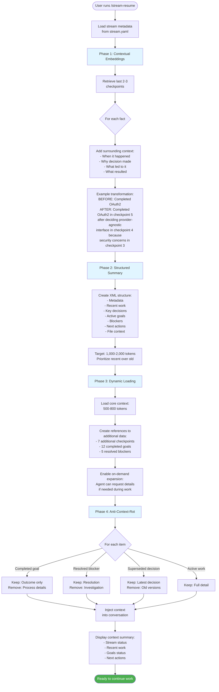

### Contextual Embedding Detail

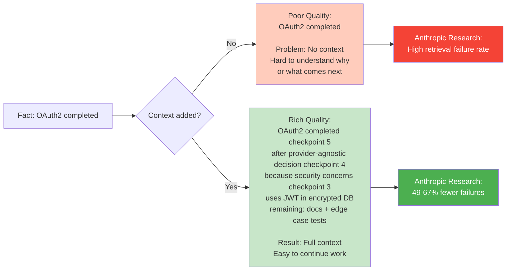

---

## 4. Multi-Agent Architecture

### Agent Coordination

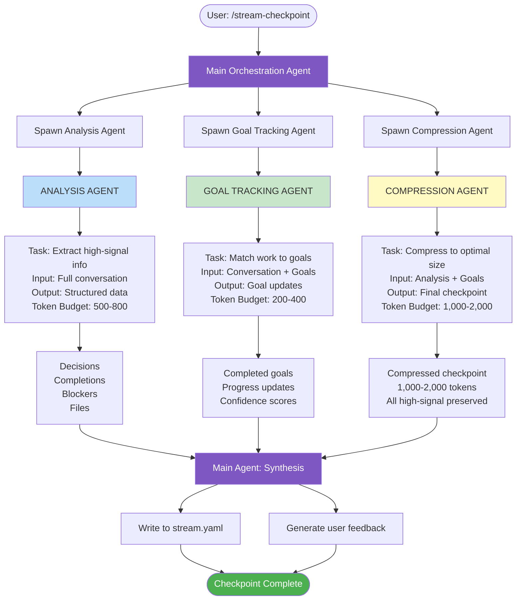

### Token Flow Diagram

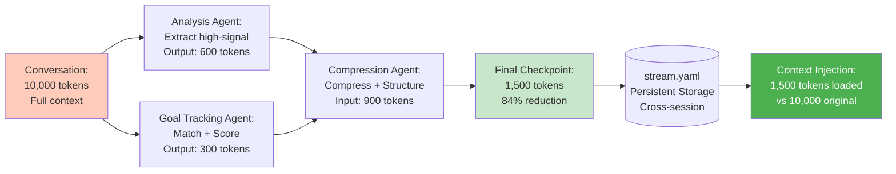

---

## 5. Goal Tracking Intelligence

### Confidence Scoring Algorithm

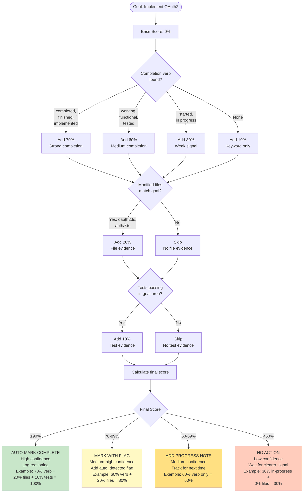

---

## 6. Current vs. Proposed Comparison

### Current v1.2.0 Workflow

```mermaid
flowchart TD
    User1([User writes code]) --> Work1[Work completed]
    Work1 --> Manual1{User remembers<br/>to checkpoint?}

    Manual1 -->|No| Lost[Context lost<br/>No record<br/>Must re-explain]
    Manual1 -->|Yes| Checkpoint1[User runs<br/>/stream-checkpoint description]

    Checkpoint1 --> Store1[Store exactly what<br/>user wrote<br/>No analysis<br/>No compression]

    Store1 --> Goals1{Goals updated?}
    Goals1 -->|No| GoalsStale[Goals become stale<br/>No tracking<br/>Manual YAML editing needed]
    Goals1 -->|Yes| Manual2[User manually edits<br/>stream.yaml<br/>Changes [ ] to [x]]

    Manual2 --> Resume1[User runs /stream-resume]
    Resume1 --> ShowMeta[Shows basic metadata:<br/>- Timestamps<br/>- Checkpoint count<br/>- Basic summary]

    ShowMeta --> ManualRead[User must manually<br/>read all checkpoints<br/>to understand context]

    ManualRead --> TooMuch{Too much info?}
    TooMuch -->|Yes| ContextOverload[Context overload<br/>Hard to find relevant info<br/>Claude Code may auto-compact]
    TooMuch -->|No| Continue1([Continue work])

    Lost --> Problem1[PROBLEMS:<br/>- Lost context<br/>- Manual goal tracking<br/>- No compression<br/>- Context overload<br/>- Repetitive work]
    GoalsStale --> Problem1
    ContextOverload --> Problem1

    style Lost fill:#f44336,color:#fff
    style GoalsStale fill:#ff9800
    style ContextOverload fill:#ff5722,color:#fff
    style Problem1 fill:#d32f2f,color:#fff
```

### Proposed v1.3.0+ Workflow

```mermaid
flowchart TD
    User2([User writes code]) --> Work2[Work completed]
    Work2 --> Checkpoint2[User runs<br/>/stream-checkpoint<br/>optional: description]

    Checkpoint2 --> Auto1[AUTONOMOUS ANALYSIS]
    Auto1 --> Extract[Extract high-signal info:<br/>- Decisions<br/>- Implementations<br/>- Problems/solutions<br/>- File context]

    Extract --> Goals2[AUTONOMOUS GOAL TRACKING]
    Goals2 --> Detect[Detect completion:<br/>- Keyword matching<br/>- File analysis<br/>- Confidence scoring]
    Detect --> AutoMark[Auto-mark goals:<br/>90%+: auto-complete<br/>70-89%: flag for review<br/>50-69%: progress note]

    AutoMark --> Compress[CONTEXT COMPRESSION]
    Compress --> Reduce[Compress 10,000 tokens<br/>to 1,500 tokens<br/>84% reduction<br/>Preserve all critical info]

    Reduce --> Store2[Store in stream.yaml<br/>Structured format<br/>Cross-session persistence]

    Store2 --> Update[Between checkpoints:<br/>/stream-update notes<br/>Lightweight tracking<br/>50-100 tokens]

    Update --> Resume2[User runs /stream-resume]
    Resume2 --> Inject[CONTEXT INJECTION]
    Inject --> Smart[Smart restoration:<br/>- Last 2-3 checkpoints<br/>- Contextual embeddings<br/>- XML structure<br/>- 1,000-2,000 tokens<br/>- Just-in-time loading]

    Smart --> Ready([Ready to continue<br/>immediately])

    Ready --> Benefits[BENEFITS:<br/>✓ Never lose context<br/>✓ Autonomous goal tracking<br/>✓ 84% token reduction<br/>✓ Intelligent restoration<br/>✓ 49-67% fewer retrieval failures<br/>✓ 39% performance improvement]

    style Auto1 fill:#4caf50,color:#fff
    style Goals2 fill:#4caf50,color:#fff
    style Compress fill:#4caf50,color:#fff
    style Inject fill:#4caf50,color:#fff
    style Ready fill:#2e7d32,color:#fff
    style Benefits fill:#1b5e20,color:#fff
```

### Comparison Matrix

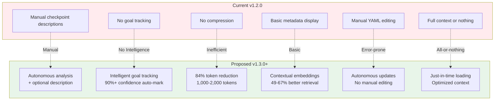

---

## Performance Metrics Visualization

### Token Efficiency

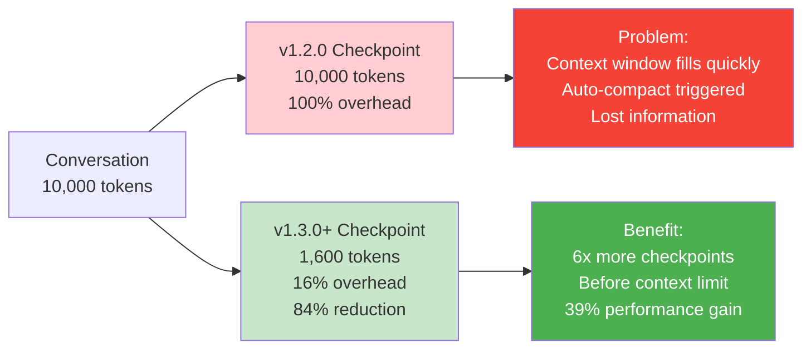

### Retrieval Accuracy

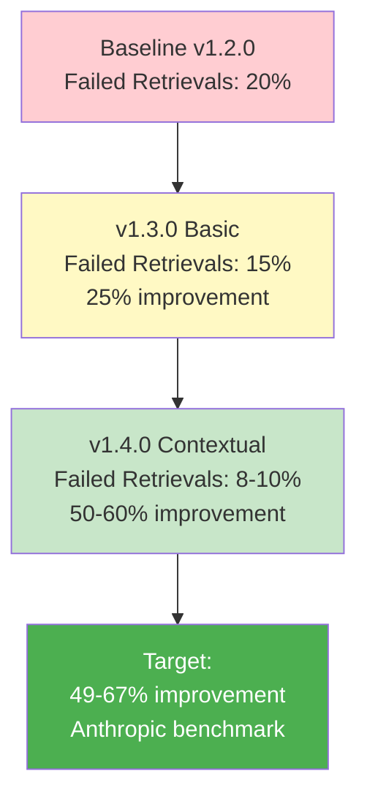

---

**Diagram Version:** 1.0
**Last Updated:** 2025-10-31
**Tools:** Mermaid.js flowcharts
**Companion:** `v1.3.0-autonomous-context-engineering-research.md`
