# Stream Archaeology Agent: Architecture Diagrams
## Visual Design Documentation for Work Streams v1.3.0

**Date:** 2025-11-02
**Version:** 1.0
**Companion Document:** v1.3.0-stream-archaeology-agent.md

---

## Table of Contents

1. [System Architecture Overview](#1-system-architecture-overview)
2. [Agent Collaboration Flow](#2-agent-collaboration-flow)
3. [Git Analysis Pipeline](#3-git-analysis-pipeline)
4. [Context Management Strategy](#4-context-management-strategy)
5. [Stream Boundary Detection Algorithm](#5-stream-boundary-detection-algorithm)
6. [User Interaction Flow](#6-user-interaction-flow)
7. [Session Memory Management](#7-session-memory-management)
8. [Sub-Agent Architecture](#8-sub-agent-architecture)
9. [Progressive Disclosure UX](#9-progressive-disclosure-ux)
10. [Integration with Existing Streams](#10-integration-with-existing-streams)
11. [Error Handling Decision Tree](#11-error-handling-decision-tree)
12. [Data Flow Diagram](#12-data-flow-diagram)

---

## 1. System Architecture Overview

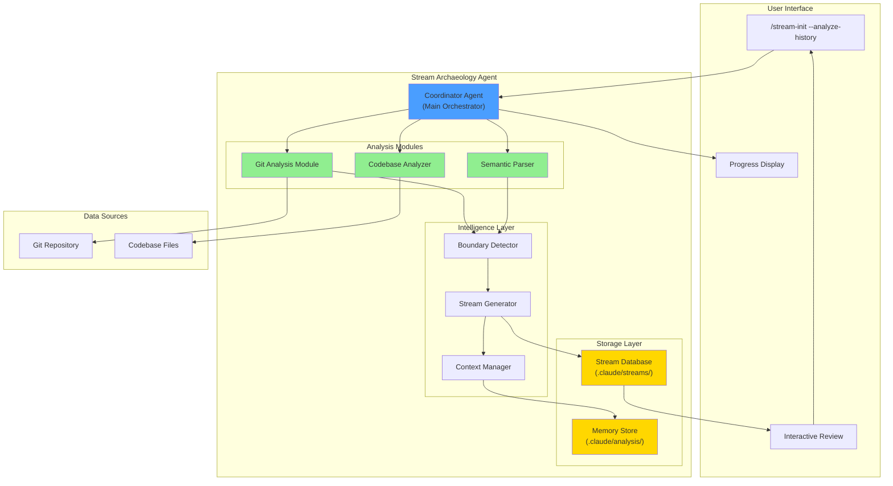

---

## 2. Agent Collaboration Flow

**Based on Anthropic's Sub-Agent Architecture**

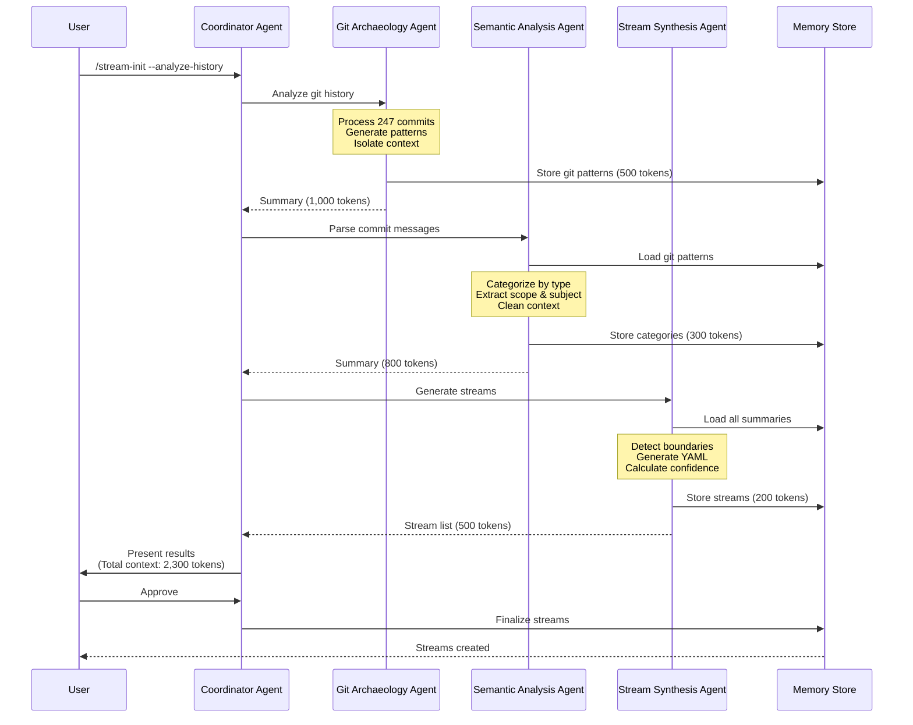

**Key Pattern:** Each sub-agent works in isolation with clean context, reports compressed summaries (1,000-2,000 tokens) to coordinator.

---

## 3. Git Analysis Pipeline

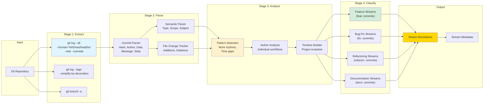

---

## 4. Context Management Strategy

**Based on OpenAI's SummarizingSession Pattern**

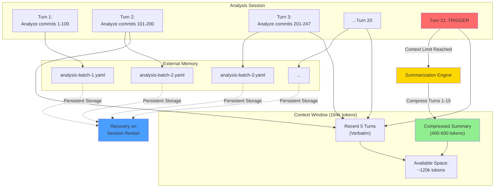

**Key Points:**
- **Context Limit:** 20 turns before summarization
- **Keep Last N:** 5 most recent turns verbatim
- **Summary Size:** 400-600 tokens optimal
- **External Storage:** Survives context rotation

---

## 5. Stream Boundary Detection Algorithm

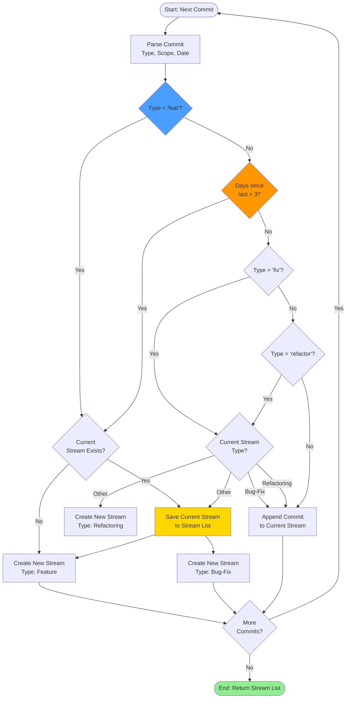

**Rules:**
1. `feat:` commits → New feature stream
2. Time gap >3 days → Stream boundary
3. Consecutive `fix:` commits → Bug-fix stream
4. Consecutive `refactor:` commits → Refactoring stream
5. Other commits → Append to current stream

---

## 6. User Interaction Flow

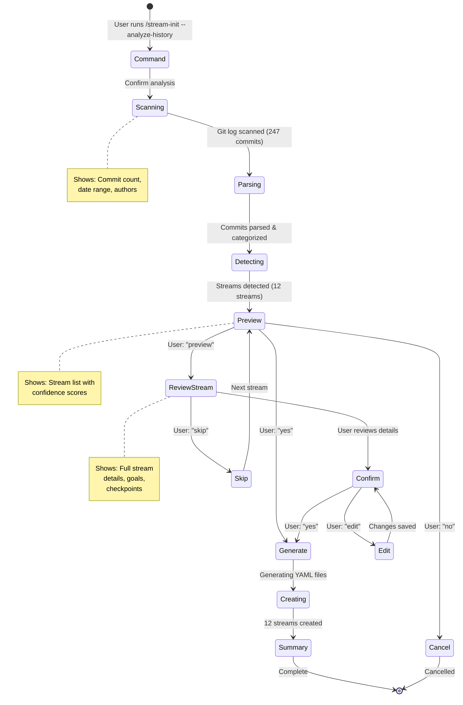

**Progressive Disclosure Pattern:**
- Start simple (confirm analysis)
- Show summary (high-level results)
- Drill down on request (preview details)
- User control at each step (yes/no/preview/edit)

---

## 7. Session Memory Management

**Context Lifecycle Across Long-Running Analysis**

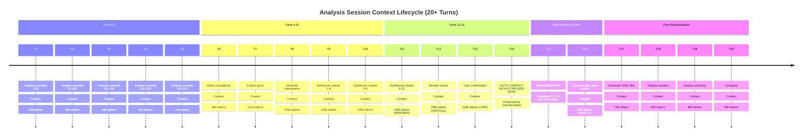

**Key Transitions:**
- **Turn 11-13:** Context approaching limit (155-160k)
- **Turn 15:** Summarization prevents auto-compact
- **Turn 16+:** Clean context, work continues seamlessly

---

## 8. Sub-Agent Architecture

**Isolating Complex Analysis Tasks**

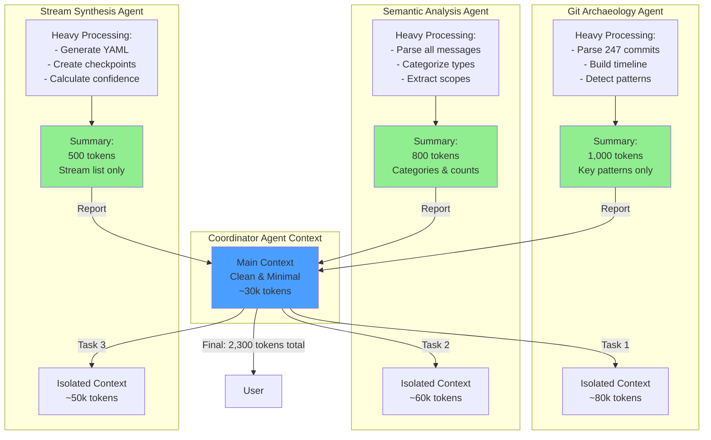

**Benefits:**
- **Isolation:** Each agent has clean context for its task
- **Compression:** Only summaries returned to coordinator
- **Scalability:** Can process unlimited commits without context overflow
- **Modularity:** Agents can be improved independently

---

## 9. Progressive Disclosure UX

**Based on 2025 Onboarding Best Practices**

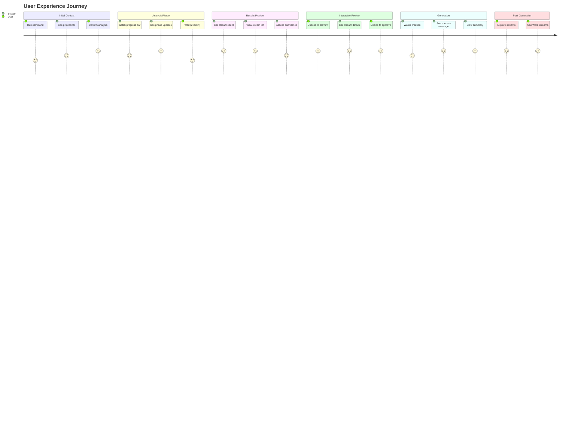

**Satisfaction Curve:**
- ✓ Quick start (single command)
- ✓ Clear progress (no black box)
- ✓ User control (preview/edit options)
- ✓ Fast value (2-3 minutes to usable streams)

---

## 10. Integration with Existing Streams

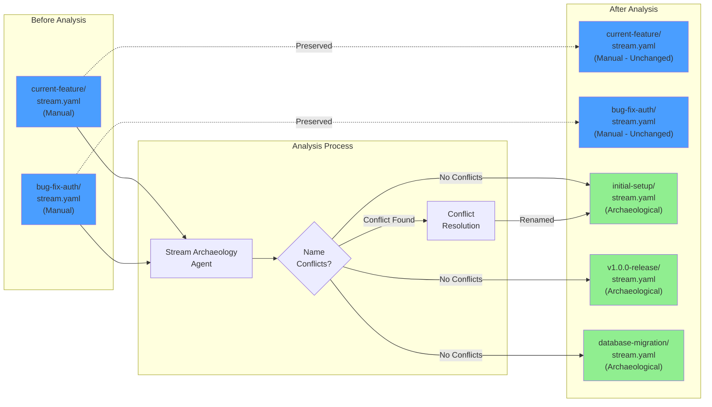

**Guarantees:**
- ✓ No overwriting of manual streams
- ✓ Conflict detection & resolution
- ✓ Coexistence of both types
- ✓ All streams accessible via existing commands

---

## 11. Error Handling Decision Tree

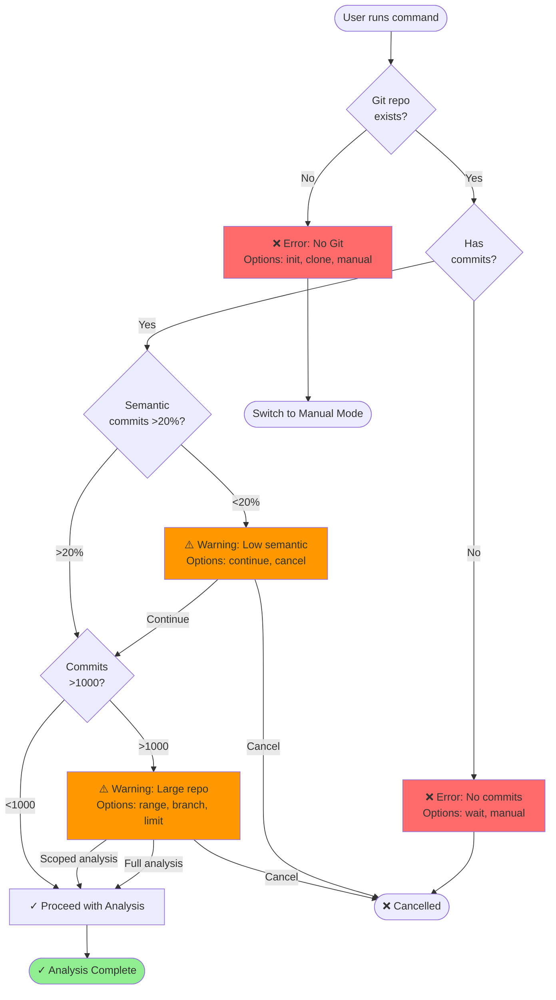

**Error Categories:**
- **Critical (Red):** Cannot proceed → Offer alternatives
- **Warning (Orange):** Can proceed with caution → User choice
- **Success (Green):** All checks passed → Continue

---

## 12. Data Flow Diagram

**Complete Flow from Git to Streams**

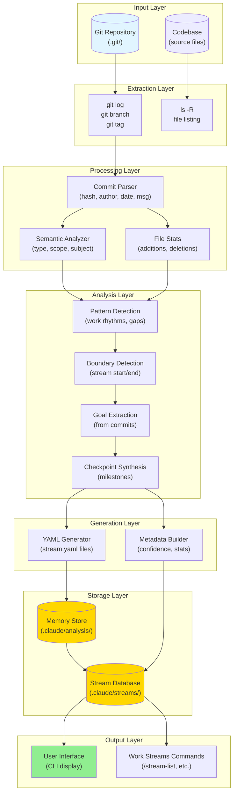

**Flow Summary:**
1. **Extract:** Git data via standard commands
2. **Process:** Parse commits into structured data
3. **Analyze:** Detect patterns and boundaries
4. **Generate:** Create stream YAML files
5. **Store:** Save to memory and streams database
6. **Output:** Display to user, enable commands

---

## Diagram Summary

### Visual Architecture Coverage

This document provides 12 comprehensive diagrams covering:

1. ✓ **System Architecture** - Overall component structure
2. ✓ **Agent Collaboration** - Sub-agent communication pattern
3. ✓ **Git Analysis** - Pipeline from git to patterns
4. ✓ **Context Management** - Session memory lifecycle
5. ✓ **Boundary Detection** - Algorithm flowchart
6. ✓ **User Interaction** - State machine for UX
7. ✓ **Session Memory** - Timeline of context evolution
8. ✓ **Sub-Agent Pattern** - Context isolation strategy
9. ✓ **Progressive Disclosure** - User experience journey
10. ✓ **Integration** - Coexistence with manual streams
11. ✓ **Error Handling** - Decision tree for failures
12. ✓ **Data Flow** - Complete end-to-end flow

### Design Principles Visualized

**Key patterns shown:**
- **Anthropic's Sub-Agent Architecture** → Diagram 2, 8
- **OpenAI's SummarizingSession** → Diagram 4, 7
- **Progressive Disclosure UX** → Diagram 6, 9
- **Context Engineering** → Diagram 4, 7, 8
- **Modular Architecture** → Diagram 1, 12

### Implementation Guidance

These diagrams serve as:
- **Architectural blueprints** for development
- **Communication tools** for team discussion
- **Validation artifacts** for design reviews
- **Documentation** for future maintenance

All diagrams use Mermaid syntax, renderable in GitHub, VS Code, and documentation tools.

---

**Document Version:** 1.0
**Last Updated:** 2025-11-02
**Format:** Mermaid Diagrams
**Companion:** v1.3.0-stream-archaeology-agent.md
